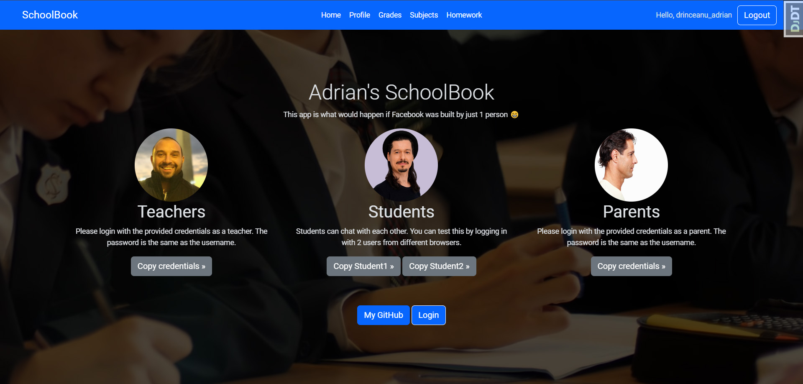
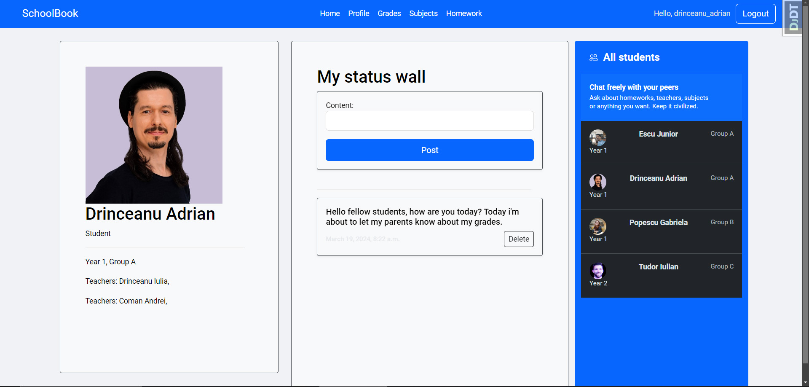
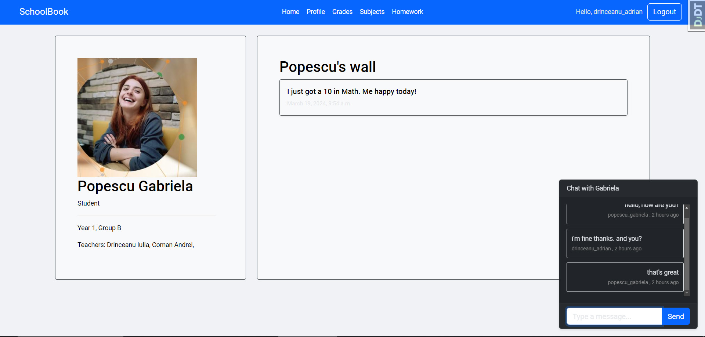
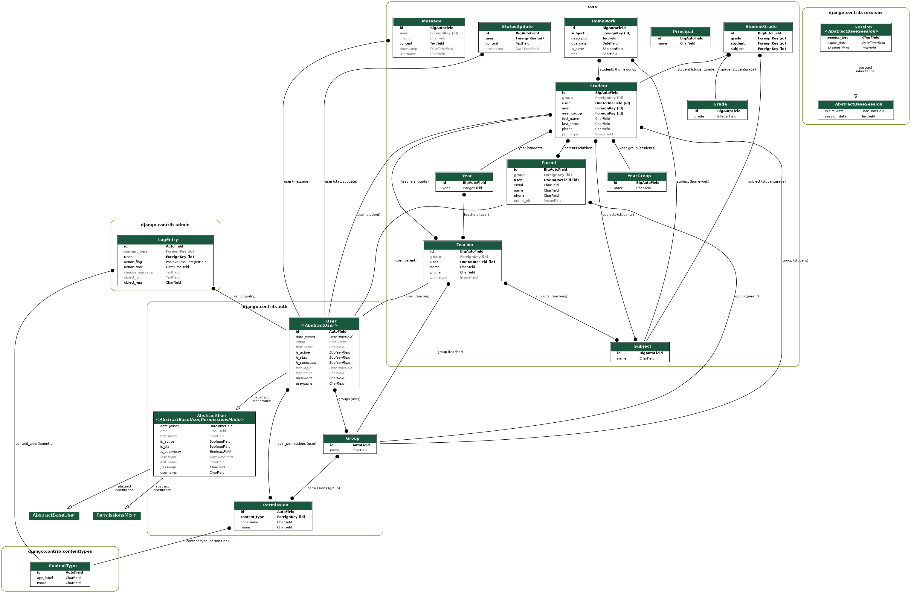

<h1>A Django School Management Project with a complete front-end. </h1>
<h3>Basically I tried to mimic Facebook in it's first years. Keep reading for details</h3>
This project is for practicing my Python/Django programing skills. 

<h3>A complex school manager with the following logic:</h3>
    <li>Teachers can view their students, and have access to their grades, parents, Subjects. Can also assign homework only to his/her students.</li>
    <li>Students can view their grades, subjects, year they are in and also their homework.</li>
    <li>Students can post a status on their wall and other students can check out the status.</li>
    <li>Students can **chat** with each other.</li>
    <li>The Parents cand view their child's grades</li>
    
<h3>Functionalities:</h3>
    <li>Chat functionality</li>
    <li>Top 10 Students</li>
    <li>Switched to ASGI</li>
    <li>Used REDIS</li>
    <li>Django Channels, Gunicorn, Uvicorn</li>

docker exec -it school_manager_in_django-web-1 bash

<h3>To do:</h3>
1. Models - DONE 
2. Views -DONE
3. Urls - DONE
4. Templates and design - DONE
5. Top/Best of logic - half way there
6. Chat system - DONE
7. final grade prediction - not yet started

<h3>You can check out finished project</h3>

